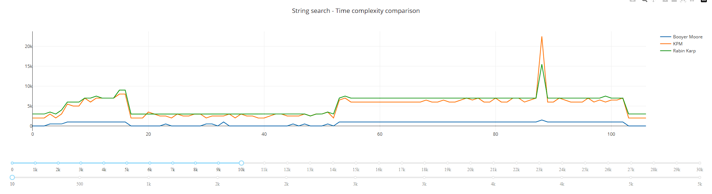
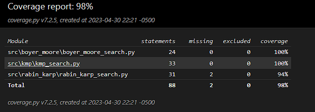

# string-searching-algorithms
Implementation of some interesting string search in python, with time complexity comparisons

## Description

Includes the implementation of popular search string algorithms.
* Knuth–Morris–Pratt
* Rabin Karp
* Boyer Moore

## Getting Started

### Dependencies

* Python 3.10.2
* Command line

### Program execution (Windows 10)

* Open the console in the project root
* If you are going to create a local environment follow the next instructions
  * Run ```python -m venv myenv```
  * Run ```.\myenv\Scripts\activate```
* To run tests ```python -m unittest discover```
* To run the app ```python app.py```

### Execution

* Generate the HTML report ```python main.py```



This graph shows the time in nanoseconds for string search.

The first slider shows the length of the string, and the second shows the size of the alphabet of the string.

Play with it! :zany_face:

### Coverage report



To replicate the coverage report, run:
* Run the tests with coverage ```python -m coverage run -m unittest discover```
* Generate the HTML report ```python -m coverage html```
* Open the report [file](htmlcov/index.html)

## Authors

Contributor names and contact info

- [alejovasquero](https://github.com/alejovasquero)

## Version History

* 1.0
    * Initial version

## License

This project is licensed under the GPL GNU License - see the [LICENSE.md](/LICENSE) file for details

## Acknowledgments

* The rabin karp algorithm was taken from [www.geeksforgeeks.org](https://www.geeksforgeeks.org/rabin-karp-algorithm-for-pattern-searching/). All the acknowledgments to them. 